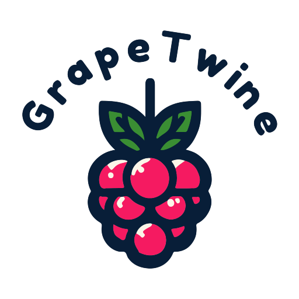

# GrapeTwine
 

 GrapeTwine is a set of tools/widgets for twine sugarcube, that makes it easier to implement AI into your text based game. This is an example project with the widgets and a few examples included. Check out the Wiki for details on how to implement it into your project.
 
 Use the demo here: https://grapetwineai.netlify.app/
